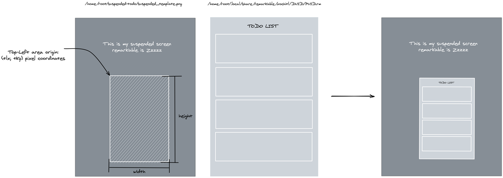

# TODO list on the Remarkable suspended screen

## Overview

This project enables the addition of a TODO list in the suspended screen of the Remarkable 2. The list is generated from a page of a document (notebook, pdf file). The suspended screen is automatically generated once the corresponding document is closed.

The idea is depicted in the next picture where a TODO list defined as a page of a document is pasted into a "template" suspended screen at pixel coordinates `(tlx,tly)` and with `(width x height)` dimensions. 

## Installation

Follow instructions [here](installation.md).

## Disclaimer

Use it at your own risk and be aware that you may void your warranty by installing software on your Remarkable. The approach should probably work on a Remarkable 1 with last version OS but I cannot be sure since I do not own a Remarkable 1.

Last version rM2 tested with ddvk hacks (2022.11.13): 2.15.1.1189

## Project origin

This project borrows ideas from:
- [remarkable_pdflets](https://github.com/Evidlo/remarkable_pdflets): showcases the use of systemd path unit to detect modifications on a file.
- [abcxyz.de blog post](http://abcxyz.de/2017/12/07/turn-rms-suspended-screen-in-something-useful/): introduced the idea to have a useful suspended screen using a page of a document. This is not working anymore because the new remarkable format for notes does not cache anymore png files for each page. 
- Various posts on the Remarkable's subreddit such as [post1](https://www.reddit.com/r/RemarkableTablet/comments/nb019i/need_help_with_small_modification_suspended/?utm_source=amp&utm_medium=&utm_content=post_title) or [post2](https://www.reddit.com/r/RemarkableTablet/comments/hg979z/has_anybody_done_this_hack_for_the_suspended/).

## Known limitations

- We are limited by the low resolution of the thumbnails, so do not use TODO lists with too small text. This is also the main reason the TODO list page is pasted into a smaller area so that the small resolution is less an issue.
- The project could be easily improved by developing a compiled binary for the Remarkable of a program that will leverage the image processing part currently done by using the GraphicsMagick package. While I am familiar with programming, I never programmed on the Remarkable tablet (looks like the Go language is commonly used).
- Similarly, instead of relying on the thumbnails we could develop a program that directly converts the Remarkable .rm format to png, probably borrowing ideas from [rm2png](https://github.com/pdbeckwith/rm2png). This would result in high resolution TODO lists.
