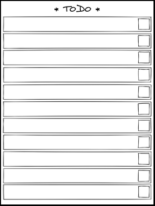

# Installation

## Before your start

Install the [prerequisites](prerequisities.md). 

Backup your custom suspended screen as it will be overwritten.

## Selection and upload of TODO list

Choose the document from which a page will be chosen as the TODO list. My advice is to use a single page document and to avoid TODO list with too small text. You will find in the `/templates` folder an example of TODO list document (`sleep_todo.pdf`):

Using your preferred method, upload the document to your Remarkable.

Using a file utility (e.g. [winscp]() in Windows) connect to your Remarkable and move to folder

    /home/root/.local/share/remarkable/xochitl/

Here will be listed all your documents with cryptic names:

You can notice that any document has two folders named `DUID` and `DUID.thumbnails`, where `DUID` is the document unique identification number. You will have to find the `DUID` of your document. If you open your document and make a small modification on it and sort the folder names based on the modification date you should find it easily. 

Once you have found your document, move into the `DUID.thumbnails` folder. You will have a series of `jpg` files, each file corresponding to one page of your document. Look for the page of interest and write down the `IUID` used to name the filename `IUID.jpg`.  

## Configuration

Once you have your `DUID` and `IUID`, we will have to do some configuration. 

In folder `/suspended-todo` you will find an example of suspended screen as file `suspended-todo.png`:

This screen has the appropriate image size (`1404x1872`) and a adequate blank space to be fill with the TODO list. Of course you can use your own custom screen, just make sure to keep the same file name and location.

First, edit the file `/suspended-todo/SUSPENDED_TODO.sh` and make sure you specify your `DUID` and `IUID`:

    # Document UID: change it to match yours!
    DUID=fdcdfd...

    # page UID: change it to match yours!
    IUID=1udfdf...

Then, open the file `/suspended-todo/SUSPENDED_TODO.path` and similarly replace the `DUID` and `IUID` in the following line:

    PathChanged=/home/root/.local/share/remarkable/xochitl/DUID.thumbnails/IUID.jpg

**REMARKS**
* use an editor that does NOT alter the jump line encoding (here UNIX), I advise to use [notepad++](https://notepad-plus-plus.org/downloads/).
* you can change the location and size of the pasted TODO list in the file `/suspended-todo/SUSPENDED_TODO.sh`. Just change the line `geometry_opt=720x960+341+809` with adequate parameters.

## Installation on the device

Copy the folder `/suspended-todo` to your Remarkable directory `/home/root`.

Using an `ssh` utility (e.g., putty), open an `ssh` command line session. Then run the following commands:

    cd /home/root/suspended-todo    
    chmod u+x install.sh
    ./install.sh

This will set the service that will monitor the update of your document used for the remarkable. If you have followed all the steps, **reboot** your Remarkable.

## Testing

Once rebooted, open your TODO list document and write something, then close it. Wait a few seconds and put your device to sleep. You should see your suspended screen with the TODO list!

In the future, if you want to change the templates for your suspended screen or todo list, simply repeat the configuration steps.  

